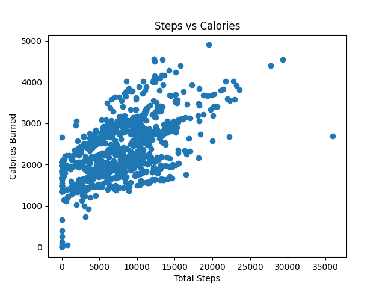
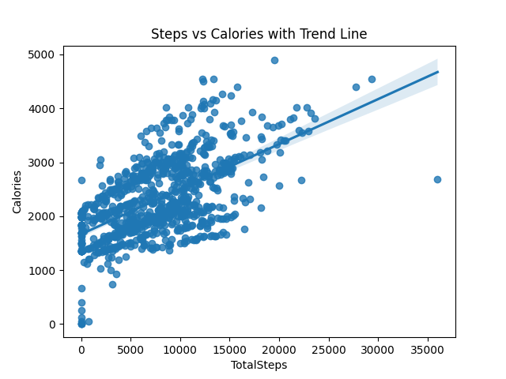

# 📊 Fitbit Activity Analysis

An exploratory data analysis project investigating what drives daily calorie expenditure using Fitbit activity data.

---

## 🎯 Objective  
To analyse which activity metrics (steps, intensity, sedentary time) are most strongly associated with calorie burn.

---

## 🛠 Tools Used  
- Python  
- pandas  
- matplotlib  
- seaborn  

---

## 📂 Dataset

This dataset contains daily activity data from Fitbit users, including steps, calories burned, and activity intensity levels.

Each row represents one user's activity for a given day.

---

## 🔍 Key Findings  

- **Total Steps** show a moderate positive correlation with calories burned, indicating that overall movement contributes to energy expenditure.

- **Very Active Minutes** have a moderate-to-strong positive correlation with calories burned, suggesting that higher intensity activity significantly increases calorie expenditure.

- **Lightly Active Minutes** show a negative relationship with sedentary time, suggesting that increased light activity replaces sedentary behaviour throughout the day.

---

## 📊 Visualisations

### Steps vs Calories

### Steps vs Calories with Trend Line

---

## 📈 Conclusion  

Both total movement (steps) and activity intensity (very active minutes) play important roles in calorie expenditure, with higher intensity activity having a stronger relationship.

---

## 🧠 Reflection  

One challenge in this analysis was interpreting why some activity metrics (such as fairly active minutes) did not show a strong relationship with calorie burn.

Through further exploration, it became clear that total steps provided a better overall measure of daily movement. This reinforced the importance of selecting appropriate variables when working with real-world datasets.

---

## ▶️ How to Run  

1. Clone this repository  
2. Install dependencies:  
   pip install pandas matplotlib seaborn  
3. Run the script:  
   python analysis.py
